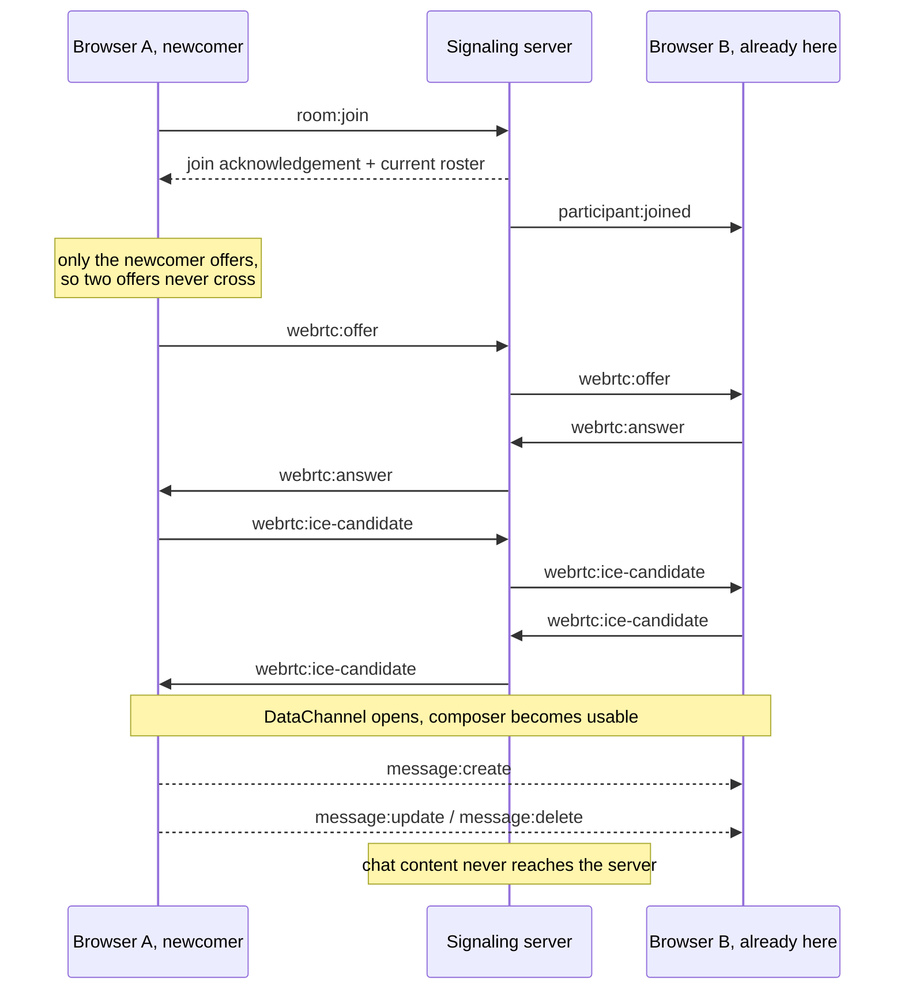

# Mesh Chat

Real-time peer-to-peer chat for small groups. Messages travel directly between
browsers over WebRTC DataChannels. A small Socket.IO server handles signaling
and presence only.


## Getting Started

Requires Node.js 22+, pnpm 9+, and a modern browser with WebRTC support.

```bash
pnpm install
pnpm dev
```

The client runs at <http://localhost:5173>. The signaling server runs on port
3001. Open the app in two or more browser windows to join the same room and
send messages between participants.

Useful checks:

```bash
pnpm build
pnpm lint
pnpm check
```

## Tests

The project has unit tests for the frontend and the server. It also has a
Playwright end-to-end test that opens two real browser participants and checks
the full chat flow: join, connect, send, edit, delete, and leave.

```bash
pnpm test
pnpm test:frontend
pnpm test:server
pnpm test:e2e
```

There are 173 unit tests and one end-to-end test.

The tests focus on the parts that are easy to check in isolation: the protocol,
reducer, link handling, and ID generation. Component tests cover visible user
behaviour, such as edit controls, rejected sends, and disabled composer states.

WebRTC is never mocked. A fake `RTCPeerConnection` would only prove that the fake
behaves as written, so peer negotiation is covered by Playwright with two real
browser contexts, and by manual checks in two and three windows.

Frontend and server have separate Vitest configurations. The frontend needs a
DOM and the server must run under Node, and a shared config would hide that
difference.

## Configuration

The app works without a `.env` file. Copy `.env.example` to `.env` only if you
want to change the defaults:

```dotenv
VITE_SIGNALING_URL=http://localhost:3001
CLIENT_ORIGIN=http://localhost:5173
PORT=3001
```

`VITE_` variables are included in the client bundle, so they should not contain
secrets.

## Architecture: Option B, Peer-to-Peer

This project uses Option B: peer-to-peer chat with WebRTC DataChannels.

The browser sends chat messages directly to the other browsers in the room. The
server does not handle chat messages. It tracks who is in the room and forwards
the signaling events peers need in order to connect.

What the server receives:

```text
room:join              join the room, and get the current roster back
webrtc:offer           forward this offer to one named participant
webrtc:answer          forward this answer to one named participant
webrtc:ice-candidate   forward this candidate to one named participant
disconnect             the socket closed
```

What the server sends:

```text
participant:joined     to everyone already in the room
participant:left       to the room when a socket closes
webrtc:offer           to the one participant it is addressed to
webrtc:answer          to the one participant it is addressed to
webrtc:ice-candidate   to the one participant it is addressed to
```

Before forwarding anything, the server checks that the sender is the participant
the payload claims to be, and that both participants are in the same room.

How a participant joins and starts chatting:



ICE candidates may arrive before the corresponding remote description. Early
candidates are queued and applied once the description is set.

I chose peer-to-peer because the main work in this exercise is real-time browser
communication. This design keeps the server small and makes the WebRTC flow
visible: offers, answers, ICE candidates, connection readiness, and DataChannel
messages.

In practice, each browser connects to every other participant. With `n`
participants, each browser holds `n - 1` peer connections. That fits small
standup-style rooms better than large public rooms.

## Message Protocol

Chat events are JSON strings sent over the WebRTC DataChannel. There are three
message events:

```json
{
  "type": "message:create",
  "payload": {
    "messageId": "0f5b7a6c-9f1e-4a3e-9c1c-2f0a5a1d7b3e",
    "authorId": "a1c4d0f2-6b7e-4c58-9a2b-13d6f8e0c5a7",
    "authorName": "Alex Fisher",
    "text": "Morning, standup in five.",
    "createdAt": "2026-08-29T09:15:04.812Z"
  }
}
```

```json
{
  "type": "message:update",
  "payload": {
    "messageId": "0f5b7a6c-9f1e-4a3e-9c1c-2f0a5a1d7b3e",
    "authorId": "a1c4d0f2-6b7e-4c58-9a2b-13d6f8e0c5a7",
    "text": "Morning, standup in ten.",
    "editedAt": "2026-08-29T09:15:41.006Z"
  }
}
```

```json
{
  "type": "message:delete",
  "payload": {
    "messageId": "0f5b7a6c-9f1e-4a3e-9c1c-2f0a5a1d7b3e",
    "authorId": "a1c4d0f2-6b7e-4c58-9a2b-13d6f8e0c5a7",
    "deletedAt": "2026-08-29T09:16:02.447Z"
  }
}
```

Important rules:

- `messageId` identifies the message across create, edit, and delete events.
- Only the original author can edit or delete a message.
- Deleted messages stay in the timeline as a "Message deleted" notice.
- Malformed events are ignored instead of throwing.
- Message text is rendered as text, not HTML.

## Project Structure

```text
frontend/src/
  app/              application shell
  features/chat/
    components/     JoinScreen and ChatPanel
    hooks/          useChatSession, which owns state and wires the rest together
    model/          types, reducer, identity, constants
    protocol/       chat events and linkification
    rtc/            peerMesh: connections, channels, ICE
    signaling/      the only place socket.io-client is imported
  lib/              shared frontend utilities
  styles/           global styles

server/src/
  config/           environment config
  rooms/            in-memory room and presence state
  signaling/        Socket.IO handlers and payload validation

shared/             signaling contracts used by frontend and server

e2e/                Playwright end-to-end test
playwright.config.ts
```

## Edge Cases

### Disconnect and reconnect

Socket.IO reconnects automatically. After reconnecting, the client rejoins the
room and uses the new roster as the source of truth.

All peer connections are rebuilt after a rejoin. This keeps the logic simple
because the app does not need to decide which old channels survived.

This was tested by restarting the signaling server with three participants
connected. The channels reopened and all three pairs could send messages again.

When a browser window closes, the server detects the socket disconnect and sends
`participant:left` to the room.

### New participants and message history

New participants do not receive old messages. This is deliberate: the server
does not store messages, and peers do not send a history snapshot.

Refreshing the page has the same effect. You rejoin with the same participant
ID from `sessionStorage`, but your local timeline starts empty.

A server-side database would change the architecture because the server would
need to receive message content. In a peer-to-peer version, an existing peer
could send a snapshot over the DataChannel, but that would need rules for which
peer sends it and how conflicts are handled.

### Large volumes of messages

Measured with two participants, one of them sending continuously:

| messages | DOM nodes | list height | scroll to top | compose keystroke |
| --- | --- | --- | --- | --- |
| 200 | 201 | 18,142px | 0ms | 2ms |
| 500 | 501 | 45,255px | 0ms | 9ms |
| 1,000 | 1,001 | 90,442px | 0ms | 3ms |
| 2,000 | 2,001 | 180,817px | 0ms | 5ms |

There is no virtualization. The list keeps one DOM node per message, so it will
slow down at some point, but it had not at 2,000.

The list follows new messages only while you are near the bottom. Scrolling up to
read history stops it following, and scrolling back down resumes it.

That behaviour was worth testing. Under a fast burst the list stopped following
and never recovered. Auto-scrolling raises scroll events of its own, and during a
burst one of those can measure a distance against messages that arrived after it.
New messages and auto-scrolling never move the view up, so only an upward move now
stops the follow.

## Bonus Tasks

Four optional tasks are implemented.

**Accessibility.** The app works with the keyboard: join, send, edit, delete,
switch tabs, and choose an emoji. It also uses labelled buttons, tab semantics,
live regions for messages and connection status, and accessible names for message
actions. Colour contrast passes WCAG AA.

**End-to-end tests.** A Playwright test covers the full flow with two real
browser participants.

**Rich content: emoji picker.** The emoji picker uses a small built-in list. It
inserts at the caret, replaces selected text, and works with arrow keys, Enter,
and Escape.

**Real-time: typing indicators.** Typing state is sent over the DataChannel as
`typing:changed`, so the server still never sees it. It stays outside
`ChatEvent` because it does not change the message timeline. Timers clear stale
typing states if a stop event is missed.

Read receipts, message history, virtualization, Docker, link previews, and
end-to-end encryption are not implemented.

## Trade-offs

- **Full mesh.** Every participant connects to every other participant. This is
  simple and truly peer-to-peer, but it is only suitable for small rooms.
- **No global message order.** Each peer connection is ordered, but there is no
  single server deciding the order across all senders.
- **No authentication.** Ownership checks stop normal UI misuse, but a modified
  client could still claim another participant's ID.
- **No TURN server.** If browsers cannot make a direct WebRTC connection, there
  is no relay fallback.
- **No message history.** New participants only see messages sent after they join.
- **One theme.** The app uses design tokens, but only one visual theme is built.

## Known Issues

- **Refreshing clears your timeline.** You rejoin with the same participant ID,
  but your local messages are gone. Other open windows still keep their copies.
- **Message privacy is architectural, not cryptographic.** The server has no chat
  message handler, and DataChannels are encrypted in transit. This is not full
  end-to-end encryption because there is no app-level key management.
- **No real screen reader pass yet.** Keyboard behaviour and ARIA are covered by
  tests, but the app has not been checked with VoiceOver or NVDA.
- **The message list is not virtualized.** It keeps one DOM node per message. It
  was tested up to 2,000 messages, but it will slow down eventually.
- **Two tabs count as two participants.** Participant IDs live in
  `sessionStorage`, so the same person in two tabs appears twice with the same
  name.

## What I'd Improve With More Time

- **Message history.** Add history for new participants, either from a peer
  snapshot or a small history API.
- **TURN support.** Add a relay so WebRTC works on stricter networks.
- **Read receipts.** Track which participants have read each message.
- **Virtualized message list.** Keep the chat fast with 10,000+ messages.
- **Screen reader testing.** Run the app with VoiceOver or NVDA and fix anything
  found.

## Time Spent

About nine hours across two sessions.

Most of the time went into the core chat flow: signaling, WebRTC connection
handling, message state, and the UI. The rest went into tests, accessibility,
the emoji picker, typing indicators, and debugging a Firefox-specific connection
issue.
