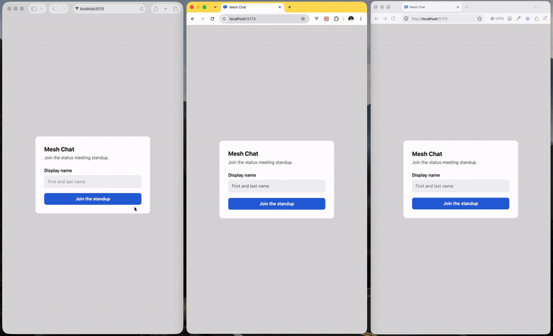
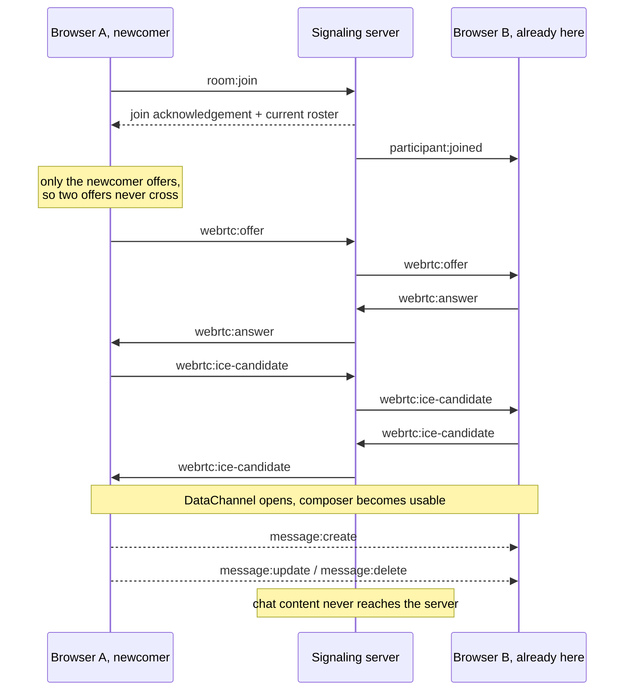

# Mesh Chat

Real-time chat for small groups. Messages go straight from one browser to
another over WebRTC DataChannels. A small Socket.IO server only helps browsers
find each other and tracks who is in the room.



## Getting Started

You need Node.js 22.12+, pnpm 9+, and a browser with WebRTC support. The pnpm
version is pinned in `package.json`, so Corepack can fetch a matching one:

```bash
corepack enable
pnpm install
pnpm dev
```

The app runs at <http://localhost:5173>, the server on port 3001. Open two or
more windows to chat between them. `pnpm build`, `pnpm lint` and `pnpm check`
are also available.

## Tests

The project includes focused frontend and server unit tests, plus a Playwright
end-to-end test covering the complete two-participant chat flow.

```bash
pnpm test
pnpm test:frontend
pnpm test:server
pnpm test:e2e
```

Unit tests cover the message reducer, peer-event validation, ownership rules and
the server's signaling boundaries. Component tests cover the interactions a user
actually performs: joining, sending, editing and deleting.

WebRTC is never mocked. A fake `RTCPeerConnection` would only prove the fake
works, so real peer connections are covered by Playwright and by hand in two and
three windows. Frontend and server have separate Vitest configs: one needs a DOM,
the other runs under Node.

## Configuration

The app works without a `.env` file. Copy `.env.example` only to change the
defaults:

```dotenv
VITE_SIGNALING_URL=http://localhost:3001
CLIENT_ORIGIN=http://localhost:5173
PORT=3001
```

`VITE_` variables are built into the client bundle, so keep secrets out of them.

To open the app on a phone on the same network, use the network address Vite
prints and change both defaults. Otherwise the phone looks for the server on
itself, and the server refuses the new origin:

```dotenv
VITE_SIGNALING_URL=http://192.168.1.10:3001
CLIENT_ORIGIN=http://192.168.1.10:5173
```

Use your own machine's address, then restart `pnpm dev`. Vite reads `VITE_`
variables at startup.

## Architecture: Peer-to-Peer

I picked peer-to-peer because the interesting part here is real-time
communication between browsers. Browsers send chat messages straight to each
other. The server never handles chat messages: it tracks who is in the room and
passes on the signaling messages browsers need to connect.

I used Socket.IO rather than a plain WebSocket for its reconnection,
acknowledgements and disconnect detection. The cost is a larger dependency and a
message format tied to Socket.IO.

```text
room:join              client joins, and gets the current list of participants
participant:joined     server tells the room that someone arrived
participant:left       server tells the room that a socket closed
webrtc:offer           forwarded to the one participant it is addressed to
webrtc:answer          forwarded to the one participant it is addressed to
webrtc:ice-candidate   forwarded to the one participant it is addressed to
```

Before forwarding anything, the server checks that the sender is the participant
the payload claims to be, and that both participants are in the same room.



An ICE candidate is one possible network route between two browsers. Candidates
often arrive before the offer or answer they belong to, so early ones are queued
and applied once the remote description is set.

Every browser connects to every other one. With `n` participants each browser
holds `n - 1` peer connections, which suits small standup rooms rather than large
public ones.

## Message Protocol

Chat events are JSON strings sent over the DataChannel. There are three:

```json
{
  "type": "message:create",
  "payload": {
    "messageId": "0f5b7a6c-9f1e-4a3e-9c1c-2f0a5a1d7b3e",
    "authorId": "a1c4d0f2-6b7e-4c58-9a2b-13d6f8e0c5a7",
    "authorName": "Alex Fisher",
    "text": "Morning, standup in five.",
    "createdAt": "2026-08-29T09:15:04.812Z"
  }
}
```

```json
{
  "type": "message:update",
  "payload": {
    "messageId": "0f5b7a6c-9f1e-4a3e-9c1c-2f0a5a1d7b3e",
    "authorId": "a1c4d0f2-6b7e-4c58-9a2b-13d6f8e0c5a7",
    "text": "Morning, standup in ten.",
    "editedAt": "2026-08-29T09:15:41.006Z"
  }
}
```

```json
{
  "type": "message:delete",
  "payload": {
    "messageId": "0f5b7a6c-9f1e-4a3e-9c1c-2f0a5a1d7b3e",
    "authorId": "a1c4d0f2-6b7e-4c58-9a2b-13d6f8e0c5a7",
    "deletedAt": "2026-08-29T09:16:02.447Z"
  }
}
```

The rules:

- `messageId` identifies the message across create, edit and delete.
- Only the original author can edit or delete a message.
- A deleted message stays in the list as a "Message deleted" note.
- Bad events are ignored instead of throwing.
- Message text is rendered as text, never as HTML.

## Project Structure

```text
frontend/src/features/chat/
  components/  JoinScreen and ChatPanel
  hooks/       useChatSession, which owns state
  model/       types, reducer, identity, constants
  protocol/    chat events and linkification
  rtc/         peerMesh: connections, channels, ICE
  signaling/   the only place socket.io-client is imported

server/src/    env config, rooms, Socket.IO handlers, validation
shared/        signaling contracts used by both sides
```

## Edge Cases

**Disconnect and reconnect.** Socket.IO reconnects on its own. The client
rejoins, trusts the new participant list, and rebuilds every peer connection, so
it never has to decide which old channels survived. I tested this by restarting
the server with three participants connected; all three pairs could send messages
again. A closed window is detected by the server, which tells the room.

**New participants and history.** Someone who joins later does not get older
messages: the server stores nothing and peers send no snapshot. Reloading is the
same. You keep your participant ID from `sessionStorage`, but your message list
starts empty.

**Many messages.** Two participants, one sending continuously:

| messages | DOM nodes | list height | scroll to top | compose keystroke |
| --- | --- | --- | --- | --- |
| 200 | 201 | 18,142px | 0ms | 2ms |
| 500 | 501 | 45,255px | 0ms | 9ms |
| 1,000 | 1,001 | 90,442px | 0ms | 3ms |
| 2,000 | 2,001 | 180,817px | 0ms | 5ms |

There is no virtualization, so the list keeps one DOM node per message. It will
slow down eventually, but it had not at 2,000. The list follows new messages
only while you are near the bottom.

## Bonus Tasks

Four optional tasks are implemented.

- **Accessibility.** Everything works from the keyboard. Buttons are labelled,
  tabs use the right roles, and live regions announce messages and connection
  changes. Colour contrast passes WCAG AA.
- **End-to-end tests.** A Playwright test covers the whole flow with two real
  browser participants.
- **Emoji picker.** A small built-in list. It inserts at the caret, replaces
  selected text, and works with arrow keys, Enter and Escape.
- **Typing indicators.** Sent over the DataChannel as `typing:changed`, so the
  server never sees them either. They sit outside `ChatEvent` because they do not
  change the message list. A timer clears a stale state if a stop event is missed.

## Error Handling

Network input is untrusted. Bad input is ignored rather than crashing the app,
and failures travel as simple reasons, so raw transport text never reaches a
user.

- **Payloads are checked at runtime.** The peer protocol and the server both
  start from `unknown` and narrow before use.
- **Joining cannot hang.** The join request times out after ten seconds and
  becomes `no-response`.
- **Bad peer messages are ignored.** `parsePeerEvent` returns `null` for invalid
  JSON, unknown events or invalid message data.
- **Typed text is not lost.** If a send or edit is rejected, the composer keeps
  the draft.
- **Signaling recovers, a dead peer does not.** A dropped signaling connection
  reconnects and rebuilds every channel. A failed peer channel is not retried;
  the composer asks you to rejoin instead of taking messages that would go
  nowhere.
- **The server checks identity and room.** A signal is forwarded only when the
  socket owns the participant ID it claims, and both participants are in the same
  room.

## Trade-offs and Current Limitations

- **Full mesh.** Everyone connects to everyone. Only good for small rooms.
- **No global message order.** Each connection keeps its own order; no server
  orders messages across senders.
- **No authentication.** The reducer and the UI enforce edit and delete ownership
  for normal clients. Because there is no authentication or signed message
  format, a modified client could forge identity fields. These are application
  rules, not a security boundary.
- **Encrypted in transit, not end to end.** DataChannels encrypt traffic between
  connected peers, and the server has no chat message handler. The app does not
  authenticate participant identities or verify peer fingerprints, so it should
  not be described as a fully authenticated end-to-end encrypted system.
- **No TURN server.** If two browsers cannot connect directly, there is no relay.
- **No message history.** New participants, and your own reloaded tab, start
  empty.
- **No virtualization.** One DOM node per message.
- **Two tabs are two participants.** IDs live in `sessionStorage`, so one person
  appears twice under the same name.
- **Localhost only by default.** Another device needs `VITE_SIGNALING_URL` and
  `CLIENT_ORIGIN` set.
- **One theme, no screen reader pass.** Only one theme is built, and the ARIA
  work has not been checked with VoiceOver or NVDA.

## What I'd Improve With More Time

Reliability and message consistency first, then UI features.

- **TURN support.** A relay for when a firewall or strict NAT blocks a direct
  connection.
- **Message history.** Let an existing peer send a recent snapshot to someone
  who just joined, keeping chat content off the signaling server.
- **Wider end-to-end coverage.** Reconnection, failures, more participants, small
  screens.
- **Accessibility testing.** Walk the app with VoiceOver and NVDA.
- **Virtualized message list.** Render only the messages on screen.
- **Read receipts.** Extend the peer protocol so participants can report what
  they have received.
- **Responsive layouts and theming.** A dark theme from the existing tokens, and
  the participant list beside the chat on wider screens.
- **File sharing.** Direct peer transfers with validation and size limits. Large
  transfers can affect DataChannel performance.

## Time Spent

About nine hours, including cross-browser debugging, automated tests and this
document. Most of it went into the core chat flow: signaling, WebRTC connection
handling, message state and the UI.
